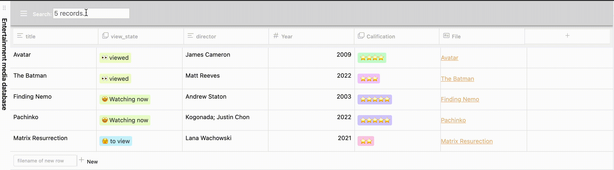

## Database folder plugin
This plugin is a Notion like database based on folders.
**[Roadmap](https://github.com/RafaelGB/obsidian-db-folder/projects/1)**
### How can I add a database?
This plugin is based on folders. You can add a folder database y by right clicking on the folder where you want to store your table

### How to use?
Database has its own type of view. It will search all notes into the same folder of the database and show the columns that you specify

The information you add or edit will be saved into the target obsidian note.

## Index
- [Whats inside database view](docs/docs/Whats%20inside%20database%20view.md)
- [Obsidian dbfolder Features](docs/docs/Obsidian%20dbfolder%20Features.md)
- [changelog](docs/changelog.md)

## Sources
### Search engine:
- [dataview](https://github.com/blacksmithgu/obsidian-dataview)

### React UI
- [react-table](https://github.com/TanStack/react-table)
- [Notion Style base](https://github.com/archit-p/editable-react-table)
