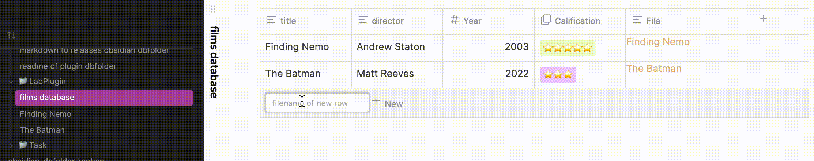
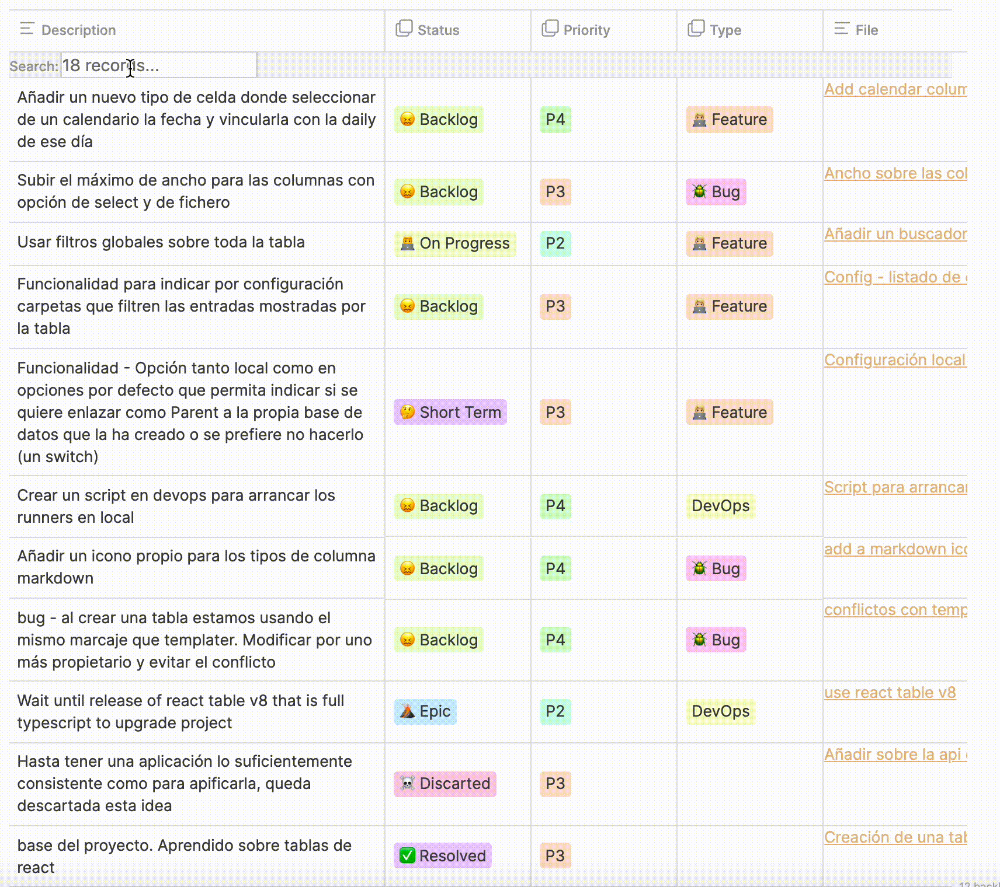

## Database folder plugin
This plugin is a Notion like database based on folders.

### How to use?
Database has its own type of view. It will search all notes into the same folder of the database and show the columns that you specify


The information you add or edit will be saved into the target obsidian note.

### Features
#### Rows
- Add new row

- Edit cells directly on table
#### Headers
- Add new column
- Edit label of existed column
- Delete column
- Order column ascending/descending
-  Drag & drop column. Order of the columns persisted
#### Filters
- Global filters


#### Event Driven
- (*NEW*) Configurable select column with `group_folder_column` property. This column will be used to group the notes into subfolders with the same cell value. The subfolder will be created if it does not exist.


### Whats inside the database view?
Database view read the yaml configuration inside .md file and render a react DOM.

You can edit directly the yaml configuration inside the .md file or use the table features to edit the columns.
#### Information
Details about your database
- **name**: Name asociated to your database (TODO)
- **description**: extra information explaining the purpose of the database (TODO)
#### Database
The *columns* key is used to charge the correct information when you charge the react-table. Each column supports all the literals of react-table column configurations. 
Mandatory:
- **input**: indicates the type of the column (text,markdown & number)
- **key**: name of obsidian field metadata in your notes (inline not supported edition yet)
- **accessor**: is the key of the data. Must be unique
- **label**: name of the column
Optional:
- **position**: order of the columns


#### Local configuration
- **enable_show_state**: show react table state at bottom of the page. It has a default value & local value of each database.
- **group_folder_column**: name of the column used to group the notes into subfolders with the same cell value. The subfolder will be created if it does not exist. It must be a select column type.
```markdown
---

database-plugin: basic

---
<%%
name: undefined
description: undefined
columns:
  title:
    input: text
    accessor: title
    label: title
    key: title
    position: 1
  director:
    input: text
    accessor: director
    label: director
    key: director
    position: 2
  Year:
    input: number
    accessor: Year
    label: Year
    key: Year
    position: 3
  Calification:
    input: select
    accessor: Calification
    label: Calification
    key: Calification
    position: 5
  view_state:
    input: select
    accessor: view_state
    key: view_state
    label: view_state
    position: 4
config:
  enable_show_state: false
  group_folder_column: view_state
%%>
```

## Sources
### Search engine:
- [dataview](https://github.com/blacksmithgu/obsidian-dataview)
### React UI
- [react-table](https://github.com/TanStack/react-table)
- [Notion Style base](https://github.com/archit-p/editable-react-table)

## Funding
[](https://www.buymeacoffee.com/5tsytn22v9Z)
