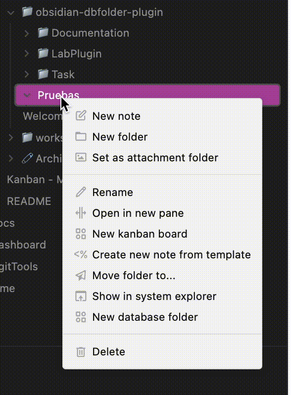

# Welcome to Obsidian Database Folder!
This plugin allows you to create [Notion](https://www.notion.so)'s like databases in your [Obsidian](https://obsidian.md) Vault.

Using the search engine of the popular [Dataview plugin](https://github.com/blacksmithgu/obsidian-dataview), you can view the content of your notes and edit the fields directly from the table without the need to open the note.

You **need** to have Dataview installed to use this plugin.

## How can I add a database?
You can add a database by right clicking on the folder where you want to store your table.
prueba
